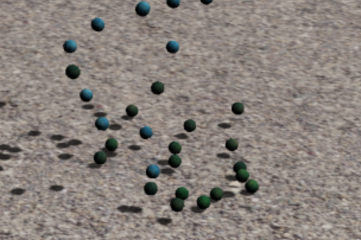
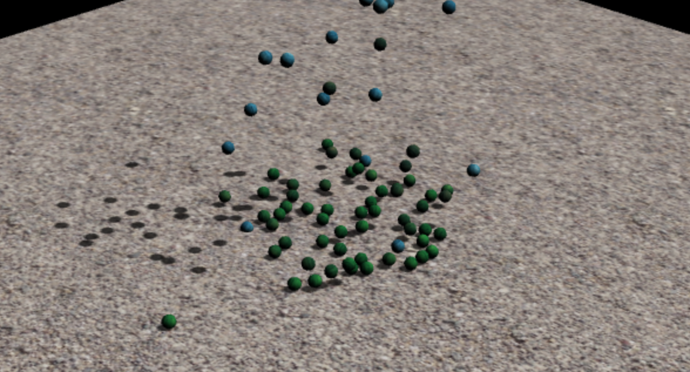

CS 184: Computer Graphics and Imaging, Spring 2018
==================================================

Final Project Milestone: Waterbending simulation
================================================

### Anna Brewer, Yining Chen, Regina Ongowarsito

Early Mishaps
-------------

Our project started out a little bumpy--we had planned on using an existing library to build off and create a fluid simulation that incorporated different types of Newtonian fluids, such as the interaction between oil and water. The library ended up having many compatibility issues and dependencies that have been graveyarded a few years back, causing us to not be able to compile the code and build off of it.

New Direction
-------------

Now, we’ve pivoted to a slightly different project; we’re using Three.js to create a “waterbending simulator” with WebGL and a Leap Motion hand tracking device. The device calculates position, direction and normal vectors of the user’s hands, and we’re hoping to use these vectors to allow users to interact with our fluid simulation.

Accomplishments and future plans
--------------------------------

So far, we’ve been able to implement spatial hashing, and use Three.js and a physics plugin for it, Physi.js, to create a collision simulation. It’s a bit laggy and slow at the moment, so we’re looking to optimize it somehow as well as We’re also partway through implementing the algorithm presented in the paper Position Based Fluids \[Macklin 2007\].

Current Progress
----------------

So far, we’ve been able to implement spatial hashing, and use Three.js and a physics plugin for it, Physi.js, to create a collision simulation. It’s a bit laggy and slow at the moment, so we’re looking to optimize it by trying to implement this paper: Research on Collision Detection Algorithm Based on Particle Swarm Optimization [\[Zhou 2010\]](https://link.springer.com/content/pdf/10.1007/978-3-642-14533-9_61.pdf). We are concerned about how we could implement this through the plugin, and may have to retry with our own implementation, but that might ultimately make our lives easier in the long run.

We’re also partway through implementing the main part of our project: the algorithm presented in the paper Position Based Fluids [\[Macklin 2007\]](http://mmacklin.com/pbf_sig_preprint.pdf). There’s quite a few equations that took us a while to understand, by cross referencing the given pseudocode and other related papers, we think we have a good grasp of how to implement the rest.

Large water droplets falling

Collided droplets in green

Revised Timeline
----------------

Even though we’ve done somewhat of a pivot since our original plan, our first two weeks in our old timeline had been dedicated to reading papers, outlining pseudocode, and getting basic physics working from our end. More or less, we’re on track, but we were definitely hoping to be a little further along at this point. The next two weeks will most likely be for more rigorous coding and pushing out more tangible results. For a more solid timeline, it’d look like:

Week 3: Code: water appearance, implement and hammer out interfacing between fluids, work towards realtime.

Week 4: integrate into leapmotion and work in animation with hand movement. Debug.

Writeup as we go along.
